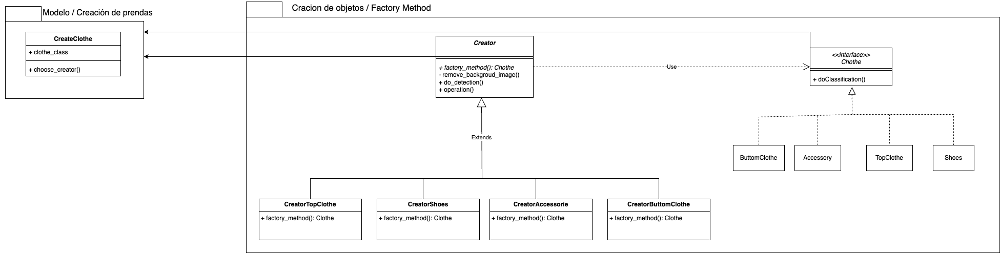

# ServerWardrobe

Aplicación de armario inteligente

## Patrón arquitectónico:

**Modelo Vista Controlador extendido a 5 capas**

2 capas de servicios:

- Conexión a servicios de terceros.
- Creación de objetos.

## Patrones de diseño:

|      Patron      |                     Función                      |
| :--------------: | :----------------------------------------------: |
| Abstract Factory |         Creación automatica del conjunto         |
|   Master Slave   | Creación de conjuntos manualmente por el usuario |
|      Proxy       |           Conexión a la base de datos            |
|     Adapter      |               Registro del usuario               |
|      Facade      |     Gestión de las vistas con el controlador     |
|  Factory Method  |               Creación de Prendas                |

## Lenguajes y frameworks

- Python
  - Flask
- React
  - JavaScript
  - TypeScript

## Comandos para correr el proyecto

### Frontend

```bash
npm install -g @ionic/cli
```

```bash
cd view
npm install
ionic serve
```

### Backend

```python
pip install pipenv
```

```python
pipenv install
```

## Patrones de diseño

### Abstract Factory


#### Ejecucion del patrón

Desde el directorio raíz del proyecto

```bash
python -m model.generateOutfit.generateOutfit 
```

### Factory Method



#### Ejecucion del patrón

Desde el directorio raíz del proyecto, puede recivir un argumento la ruta de la imagen que se desea procesar y clasificar o por defecto se procesa una imagen de una [chamarra](./services/db/images/inputs/chamarra1.png)

```bash
python -m model.createClothe.createClothe <ruta_imagen>
```

```bash
python -m model.createClothe.createClothe
```


### Master Slave


### Proxy


### Adapter


### Facade


### Ejecucion de la aplicacion (backend)
Una vez instalado Flask ubicado en la carpeta raiz del proyeto ejecute el comando 
```bash
python app.py 
```
o si se trata de un sistema unix:
```
python3 app.py
```
Este comando dara inicio al servicio web de la aplicacion, una vez iniciado el servicio web de la aplicacion, se pueden empezar a hacer peticiones desde las interfaces graficas de usuario de la aplicacion. El ejecutar este archivo es el que da inicio a la fachada, el cual funge como superoyente en el sistema.  El siguiente paso es ejecutar la aplicacion para empezar a hacer peticiones.
### Ejecutar la vista de la aplicacion
Ubicado en la carpeta "view", una vez instalado el framework Ionic y de haber instalado las dependencias correspondientes, podemos emplear el comando:
```
ionic serve
```
Una vez que la aplicacion se este ejecutando, se abrira una ventana en el navegador, donde se debera visualizar la "landing page" del sistema.


