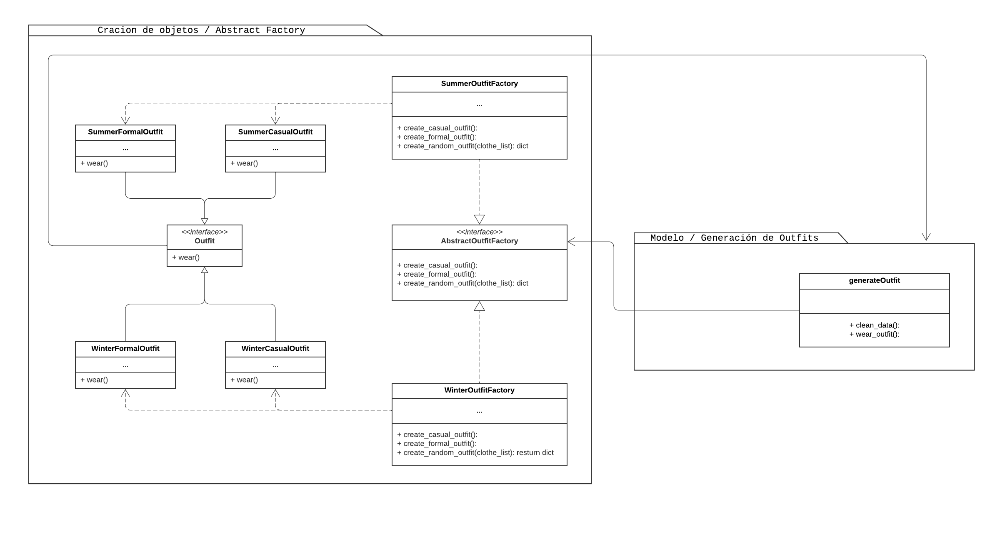

# ServerWardrobe

Aplicación de armario inteligente

## Patrón arquitectónico:

**Modelo Vista Controlador extendido a 5 capas**

2 capas de servicios:

- Conexión a servicios de terceros.
- Creación de objetos.

## Patrones de diseño:

|      Patron      |                     Función                      |
| :--------------: | :----------------------------------------------: |
| Abstract Factory |         Creación automatica del conjunto         |
|   Master Slave   | Creación de conjuntos manualmente por el usuario |
|      Proxy       |           Conexión a la base de datos            |
|     Adapter      |               Registro del usuario               |
|      Facade      |     Gestión de las vistas con el controlador     |

## Lenguajes y frameworks

- Python
  - Flask
- React
  - JavaScript
  - TypeScript

### Abstract Factory

### Master Slave

### Proxy

### Adapter

### Facade

